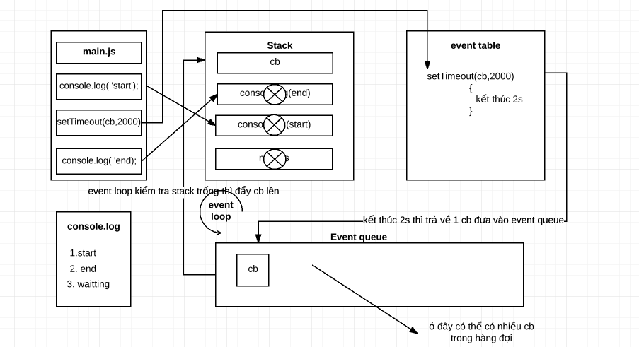

# Event-Loop-and-Call-stack
## Call Stack
* Trước khi đi vào tìm hiểu về vấn đề "event loop và call stack" trong javascript thì ta cùng xem lại cách thức thực thi các câu lệnh trong 1 chương trình được viết bằng javascript như sau:
- Như ta đã biết javascript xử lý đơn luồng. Do đó nếu ta đang chạy một dòng code trong Javascript mà cần một thời gian dài để hoàn thành tác vụ đó, thì nó sẽ block(chặn) tất cả đoạn code sau nó, và các đoạn code đằng sau chỉ thực hiện được khi đoạn code trước đó đã hoàn thành. Giả sử nếu ta đang ở một trang web và ta bấm vào một nút trên trang web, sau đó trang web vì lý do nào đó mà bị treo. Bạn thử click vào các nút khác nhưng không được, các nút này không hoạt động. Nguyên nhân này là do các nút sau nó đã bị chặn.
* Giả sử ta có một file main.js như sau:
```javascript
    function now(txt) {
    console.log(new Date().toLocaleTimeString()+ ' ' + txt);
}

function wait(miliseconds) {
    var statTime = new Date().getTime();
    while (new Date().getTime() < statTime + miliseconds);
}

now('> start to wait');
wait(5000);
now('> finish waiting');
- Trong đó function now(txt) là hàm in ra một dòng lệnh với thời gian khi bắt đầu thực thi và kết thúc. 
- function wait(5000) là hàm để xác định thời gian chính xác để hoàn thành tác vụ
    
```
* Sau khi chạy chương trình thì ta có kết quả như sau:
```javascript
    11:09:12 PM > start to wait
    11:09:17 PM > finish waiting
- ta thấy khoảng cách từ khi bắt đầu và kết thúc chương trình là 5s và 5s này chính là thời gian hàm wait(5000) hoàn thành.
```
* Như vậy từ ví dụ trên ta có thể thấy hàm wait(5000) đã ngăn tất cả các hàm phía sau nó => đây là blocking trong Javascript và nó sử dụng một Call stack (theo cơ chế vào sau ra trước)cơ chế của nó hoạt động như sau:
* Ta coi thứ tự thực hiện của các dòng lệnh như sau:
1. now('> start to wait')
2. wait(5000)
3. now('> finish waiting')
Vì đây là 3 câu lệnh chạy hoàn toàn tách biệt không có sự liên quan đến nhau nên khi đưa từng lệnh vào call stack thì nó sẽ thực hiện ngay và đi ra khỏi call stack để nhường chỗ cho lệnh tiếp theo.
- đầu tiên gọi hàm now('> start to wait') đưa hàm này vào call stack do hàm này chỉ có lệnh log ra thời gian và text nên sau khi log xong thì nó sẽ được lấy ra khỏi stack
- tiếp theo gọi hàm wait(5000) hàm này chạy 5s sau thì hoàn thành sau khi hoàn thành và trong stack lúc này là trống
- cuối cùng gọi tiếp hàm now('> finish waiting') hàm này cũng chỉ log ra thời gian thực hiện do vậy sau khi thực hiện xong thì nó bị lấy ra khỏi stack trong stack lúc này còn hàm main() và không còn dòng code nào nữa nên hàm main() cũng bị xóa luôn khỏi stack
=> đây là cơ chế xứ lý blocking của javascript như ta thấy nó có nhược điểm là chỉ cần có 1 tác vụ nào đó có thời gian xử lý lâu thì tất cả các đoạn tác vụ đằng sau nó sẽ bị chặn không thực hiện được để giải quyết vấn đề này ta tìm hiểu khái niệm Event loop dưới đây
## Event Loop
* Như ở trên là cơ chế xử lý blocking của javascript ta thấy nó có nhược điểm là chỉ cần có 1 tác vụ nào đó có thời gian xử lý lâu thì tất cả các đoạn code đằng sau nó sẽ bị chặn không thực hiện được do vậy ta phải nên tránh blocking, nhưng tránh như thế nào? Như ta đã biết trong javascript cung cấp một cơ chế bất đồng bộ thông qua các hàm callback và một cơ chế được sử dụng đó là "event loop". Chúng ta cùng tìm hiểu xử lý bất đồng bộ trong javascript và cơ chế "event loop" qua các ví dụ dưới đây.
- cho một chương trình như sau:
```javascript
    function now(txt) {
        console.log(new Date().toLocaleTimeString()+ ' ' + txt);
    }
        now('> Bat dau tac vu');
        process.nextTick(function () {
             now('> DO this task at the end of event queue')
        })
        now('> Ket thuc')
- Kết quả in ra như sau:
       11:51:20 PM > Bat dau tac vu
       11:51:20 PM > Ket thuc
       11:51:20 PM > DO this task at the end of event queue

```
- Như vậy nhìn vào kết quả trên ta thấy các lệnh trong hàm process.nextTich() được thực hiện sau cùng.
- Ta xét một ví dụ tiếp theo
```javascript
console.log(new Date().toLocaleTimeString()+ ' ' + 'start');
 setTimeout(function () {
     console.log(new Date().toLocaleTimeString()+ ' ' + 'waitting...')
 },2000);
 console.log(new Date().toLocaleTimeString()+ ' ' + 'end
- Kết quả in ra như sau:
       9:47:20 AM start
       9:47:20 AM end
       9:47:22 AM waitting...   
```

* Trạng thái hoạt động
    
- Nhìn vào sơ đồ ta ta thấy có các thành phần như sau:
1. Stack: là cấu trúc kiểu ngăn xếp chứa các khối lệnh được chạy
2. Nơi đăng kí các sự kiện
3. Event queue là hàng đợi chứa các câu lệnh được trả về sau khi hoàn thành một tác vụ nào đó(như các setTimeout, promise, các sự kiện click ...)
4. Event loop lặp liên tục kiểm tra xem stack có rỗng không nếu rỗng sẽ đẩy các lệnh dưới event queue lên.
- Với đoạn code trên được giải thích như sau:
- Đoạn code trong chương trình chạy tuần tự từ đầu đến cuối
- Đầu tiên nó gọi hàm main() trong hàm main() gặp câu lệnh 
    "console.log('start')" với câu lệnh này nó được đưa vào trong stack được lấy ra ngay và thực thi luôn câu lệnh log('start') trong stack lúc này chỉ có hàm main().
- Tiếp theo nó gặp hàm setTimeout(cb,2000) nhưng hàm này không được đưa vào stack mà được đưa sang event table và trong quá trình chờ kết thúc 2s thì nó gọi luôn câu lệnh tiếp theo là "console.log('end')" lệnh này được đưa vào stack và nó bị lấy ra và thực hiện ngay => log ra màn hình "end"
- Sau khi kết thúc 2s thì setTimeout(cb,2000) trả về 1 hàm cb và hàm này được đẩy xuống event queue tại đây nó được event loop kiểm tra xem hàng đợi có rỗng không lúc này hàng đợi đang rỗng nên nó sẽ đẩy hàm cb từ dưới Event queue lên Stack và thực thi câu lệnh in đoạn text "waitting..."
- Giả sử ta có một đoạn code khác như sau:
```javascript
    console.log(new Date().toLocaleTimeString()+ ' ' +'start')
setTimeout(function () {
    console.log(new Date().toLocaleTimeString()+ ' ' +'there1')
},1000)
setTimeout(function () {
    console.log(new Date().toLocaleTimeString()+ ' ' +'there2')
}, 2000);
setTimeout(function () {
    console.log(new Date().toLocaleTimeString()+ ' ' +'there3')
}, 1000)
console.log(new Date().toLocaleTimeString()+ ' ' +'end')

- kết quả in ra như sau:
    11:20:44 AM start
    11:20:44 AM end
    11:20:45 AM there1
    11:20:45 AM there3
    11:20:46 AM there2

```
- Như vậy 2 câu lệnh log vẫn thực được thực thi trước còn lại 3 hàm setTimeout() sẽ lần lượt được đưa vào event table chương trình được thực thi rất nhanh nên ta cảm nhận cả 3 hàm setTimeout(1000),setTimeout(2000),setTimeout(1000) được thực hiện tại cùng 1 thời điểm trong event table và ở đây có 2 hàm setTimeout(1000) nhưng hàm đầu tiên vào trước nên nó sẽ xong trước rồi đẩy xuống event queue trước và hàm setTimeout(1000) thứ 2 do thứ tự sau nên nó sẽ đứng sát hàm setTimeout(1000) thứ nhất chính vì như vậy mới có kết quả như trên


